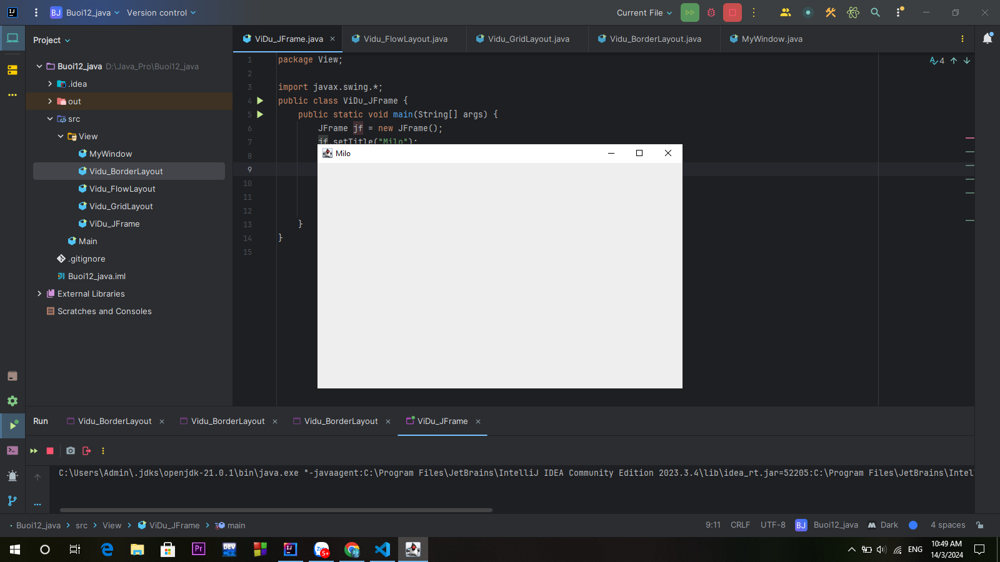
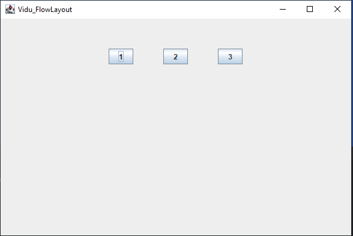
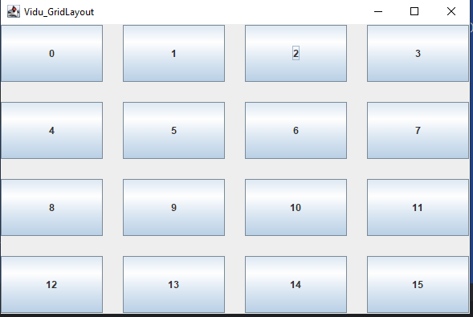
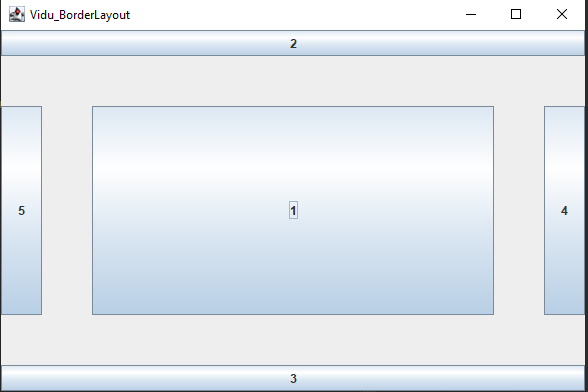
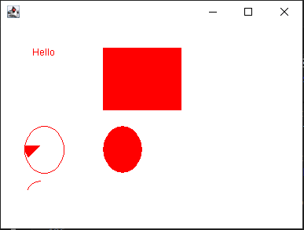

Thư viện đồ hoạ Swing cơ bản

JFrame, JButton, JLabel, JTextField, JTable, JList

BorderLayout, FlowLayout, GridLayout

Graphics2D, Image

# [JAVA] - BUỔI 12: THƯ VIỆN ĐỒ HOẠ SWING
## Thư viện đồ hoạ Swing cơ bản
### Khái niệm
**Swing** là thư viện các đối tượng để lập trình giao diện đồ hoạ trong Java. Trước đây thư viện AWT là thư viện tiêu chuẩn cho lập trình giao diện, sau này Swing được phát triển kế thừa một số lớp của AWT, hoạt động nhẹ hơn và độc lập với nền tảng thiết bị, và bổ sung thêm nhiều lớp hiển thị mạnh mẽ hơn.

Mỗi thành phần trong Swing được gọi là component. Component được chia làm 2 loại:

* Loại khung chứa: là những component định nghĩa khung chứa các component khác bên trong. Các component loại này ko thực hiện chức năng hiển thị nội dung, mà chỉ định nghĩa kích thước, nền, cách sắp xếp và hiển thị các component bên trong. Các component khung chứa thường dùng như JFrame, JPanel, JDialog, …
* Loại hiển thị: là những component đơn vị thực hiện chức năng hiển thị nội dung. Các component hiển thị thường dùng như JLabel, JButton, JList, JTextField,…
### Ứng dụng
Java Swing được dùng để hỗ trợ tạo giao diện đồ hoạ người dùng (với Java).

Bộ công cụ này cung cấp các bộ điều khiển nâng cao như thanh trượt, colorpicker, Tree, TabbedPane và bảng điều khiển,..

Swing có những đặc điểm:

* Độc lập với thiết bị
* Có thể tuỳ chỉnh, mở rộng
* Khá nhẹ
* Có thể cấu hình
### Cấu trúc phân cấp lớp Java Swing


Tất cả các thành phần trong swing được kế thừa từ lớp Jcomponent như JButton, JComboBox, JList, JLabel đều có thể được thêm vào lớp Container.

**Lớp Container** là các lớp vùng chứa là các lớp có thể có các thành phần khác trên đó. Vì vậy, để tạo Java Swing GUI, chúng ta cần ít nhất một đối tượng container. Có 3 loại vùng chứa Java Swing.

1. Bảng điều khiển : Nó là một vùng chứa thuần túy và bản thân nó không phải là một cửa sổ. Mục đích duy nhất của Panel là tổ chức các thành phần trên một cửa sổ.
2. Khung : Đây là một cửa sổ hoạt động đầy đủ với tiêu đề và các biểu tượng.
3. Hộp thoại : Nó có thể được coi như một cửa sổ bật lên bật ra khi một tin nhắn được hiển thị. Nó không phải là một cửa sổ hoạt động đầy đủ như Frame.

**GUI** (Giao diện người dùng đồ họa) trong Java  là một trình tạo trải nghiệm trực quan dễ sử dụng cho các ứng dụng Java. Nó chủ yếu được làm bằng các thành phần đồ họa như nút, nhãn, cửa sổ, v.v. mà qua đó người dùng có thể tương tác với ứng dụng. GUI đóng một vai trò quan trọng để xây dựng giao diện dễ dàng cho các ứng dụng Java.

Ví dụ:
```java
import javax.swing.*;
public class ViDu_JFrame {
    public static void main(String[] args) {
        JFrame jf = new JFrame();
        jf.setTitle("Milo");
        jf.setSize(600,400);
        jf.setLocation(300, 300); //Vị trí hiển thị
        jf.setDefaultCloseOperation(JFrame.EXIT_ON_CLOSE);
        //Thoát chtr khi đóng cưa sổ JFrame
        jf.setVisible(true); // Cho phép hiển thị
    }
}
```



## JFrame, JButton, JLabel, JTextField, JTable, JList
### JFrame
#### Định nghĩa
JFrame là một container(Nơi chứa và sắp xếp các component khác của Java Swing, có thể là các container khác) trong ứng dụng Java Swing, nó được dùng để chứa và sắp xếp các phần con như Button, Label, TextField, etc.

#### Cách tạo một JFrame
```java
JFrame jf = new JFrame();
```
Mặc định khi một JFrame được khởi tạo xong nó sẽ ở trạng thái ẩn, tất là người dùng sẽ không thấy được. Nếu muốn hiển thị JFrame này đến người dùng chúng ta cần gọi đến setVisible(boolean visible) với giá trị truyền vào:

* True – JFrame sẽ hiện thị ra giao diện.
* False – JFrame sẽ bị ẩn đi.

#### Xử lý khi JFrame bị đóng

Khi một JFrame được khởi tạo, cho đến khi người dùng tắt JFrame này thì chúng ta có thể định nghĩa các hành động tương ứng mà chúng ta muốn trong giai đoạn này. Java Swing cung cấp 4 hằng số tương ứng với 4 loại hành động sau khi một JFrame bị đóng. Các hằng số này được định nghĩa trong trong avax.swing.WindowsConstants:

* **DO_NOTHING_ON_CLOSE**– Không làm thêm bất cứ điều gì khi JFrame bị đóng
* **HIDE_ON_CLOSE** – JFrame sẽ bị ẩn đi khi người dùng đóng nó lại. Chương trình vẫn sẽ hoạt động bình thường trong khi JFrame này bị ẩn. Đây là một hành động mặc định của JFrame.
* **DISPOSE_ON_CLOSE** – Sau khi bị đóng lại, nó đồng thời sẽ bị dọn dẹp rác, các tài nguyên được JFrame này sử dụng sẽ bị thu hồi nhường chỗ cho những nơi khác sử dụng.
* **EXIT_ON_CLOSE** – Sau khi JFrame bị đóng, chương trình cũng sẽ tắt theo.
* 
Chúng ta có thể đặt hành vi đóng mặc định của JFrame bằng cách chuyển một trong bốn hằng số vào phương thức setDefaultCloseOperation () của nó

Ví dụ:
```java
jf.setDefaultCloseOperation(JFrame.EXIT_ON_CLOSE);
```
#### Chiều cao, rộng và vị trí của JFrame trên màn hình Desktop
Mặc định khi JFrame được khởi tạo thì vị trí xuất hiện của nó trên mành hình Desktop nằm ở phía trên bên trái cùng của màn hình. Kích thước tuỳ thuộc vào các component chứa trong nó.

Để thay đổi kích thước và vị trí mặc định của JFrame, ta có thể sử dụng:

* setSize(width, height) – Chỉ định chiều rộng vào chiều cao của JFrame
* setLocation(int x, int y) – Chỉ định toạ độ của JFrame trên màn hình theo 2 trục X, Y
* setBounds(int x, int y, int width, int height) – Cách sử dụng nhanh, gộp 2 hàm ở trên lại thành
* setLocationRelativeTo() - Căn JFrame giữa màn hình Desktop

Ví dụ:
```java
jf.setSize(600,400);
jf.setLocation(300, 300);
```

Muốn kích thước của JFrame lớn bằng màn hình desktop, hay chiều rộng bằng với chiều rộng của màn hình Desktop thì JFrame cũng hỗ trợ một số tuỳ chọn:

* NORMAL – Hiển thị kích thước thông thường
* ICONIFIED – Hiển thị kích thước thu nhỏ
* MAXIMIZED_HORIZ – Hiển thi với kích chiều rộng đạt kích thước tối đa
* MAXIMIZED_VERT – Hiển thi với kích chiều cao đạt kích thước tối đa
* MAXIMIZED_BOTH – Hiển thị với kích thước chiều cao và chiều rộng đạt kích thước tối đa

Để sử dụng các tuỳ chọn trên chúng ta cần sử dụng setExtendedState() method với các tuỳ chọn tương ứng.

Ví dụ:
```java
frame.setExtendedState(JFrame.MAXIMIZED_BOTH);
```
### JButton

Button được biết đến như là một nút nhấn tương tác được sử dụng rất nhiều trong Java Swing cùng với Label, TextField, etc.

Để khởi tạo một Button trong Java Swing chúng ta có thể làm như sau:

```java
JButton jButton_1 = new JButton("1");
```

#### Tạo Button với Icon Trong Swing
* Button chỉ chứa hình

Ví dụ:
```java
        JButton jb1 = new JButton(new ImageIcon("C:/Users/Admin/Pictures/5243423.png"));
```
* Button chứa cả hình và chữa

```java
        JButton jb1 = new JButton("1", new ImageIcon("C:/Users/Admin/Pictures/5243423.png"));
```
#### Xử lý sự kiện trong Button
```java
button.addActionListener(new ActionListener() {
    @Override
    public void actionPerformed(ActionEvent evt) {
        // do everything here...
    }
});
```
### JLabel
JLabel là một thành phần đồ họa trong thư viện Java Swing được sử dụng để hiển thị một đoạn văn bản hoặc hình ảnh tĩnh trên giao diện người dùng. Nó thường được sử dụng để hiển thị nhãn, tiêu đề, thông báo, hoặc dữ liệu cố định.

Để khởi tạo một Button trong Java Swing chúng ta có thể làm như sau:
```java
 JLabel lb = new JLabel("Hello");
```
#### Tùy chỉnh giao diện của JLabel
Để tùy chỉnh giao diện của JLabel trong Java Swing, bạn có thể sử dụng các phương thức và thuộc tính của nó. Dưới đây là một số tùy chọn phổ biến:

1. Đặt font chữ:

* Sử dụng phương thức `setFont(Font font)` để đặt font chữ cho JLabel. Ví dụ: label.setFont(new Font("Arial", Font.BOLD, 16)).
2. Đặt màu sắc:

* Sử dụng phương thức `setForeground(Color color)` để đặt màu sắc của chữ trong JLabel. Ví dụ: label.setForeground(Color.RED).

3. Đặt hình ảnh:

* Sử dụng phương thức `setIcon(Icon icon)` để đặt một biểu tượng (Icon) cho JLabel. Ví dụ: label.setIcon(new ImageIcon("image.png")).

4. Căn chỉnh văn bản:

* Sử dụng phương thức `setHorizontalAlignment(int alignment)` để căn chỉnh văn bản theo chiều ngang. Các giá trị alignment có thể là SwingConstants.LEFT, SwingConstants.CENTER, SwingConstants.RIGHT. Ví dụ: label.setHorizontalAlignment(SwingConstants.CENTER).
* Sử dụng phương thức `setVerticalAlignment(int alignment)` để căn chỉnh văn bản theo chiều dọc. Các giá trị alignment có thể là SwingConstants.TOP, SwingConstants.CENTER, SwingConstants.BOTTOM. Ví dụ: label.setVerticalAlignment(SwingConstants.CENTER).

5. Định dạng văn bản:
* Sử dụng phương thức `setText(String text)` để đặt nội dung văn bản cho JLabel. Ví dụ: label.setText("Hello, World!").
* Sử dụng phương thức `setToolTipText(String text)` để đặt một thông báo gợi ý cho JLabel. Ví dụ: label.setToolTipText("This is a JLabel").

6. Kích thước và vị trí:
* Sử dụng phương thức `setSize(int width, int height)` để đặt kích thước của JLabel. Ví dụ: label.setSize(200, 100).
* Sử dụng phương thức `setLocation(int x, int y)` để đặt vị trí của JLabel trong container cha. Ví dụ: label.setLocation(50, 50).

### JTextField 
JTextField là một component cho phép nhập và chỉnh sữa đoạn văn bản trên cùng một dòng vì thế nó thường phù hợp cho việc nhập, chỉnh sửa các thông tin dạng ngắn gọn, mang đại ý như là email, password, tên công ty, tên sinh viên, etc. 

Khởi tạo một JTextField:
```java
JTextField jTextField = new JTextField();
```
Khởi tạo một JTextField với đoạn văn bản có sẵn:
```java
JTextField jTextField = new JTextField("Default Text");
```
Trong JTextField có một thuộc tính gọi là columns được dùng để tính toán độ rộng của JTextField, mặc định nó là 0 nên khi không có dữ liệu thì kích thước của nó sẽ rất nhỏ. Để chỉ định columns cho JTextField có thể khởi tạo như sau:
```java
JTextField textField = new JTextField(20);
```
Để lấy giá trị của String trong JTextField chúng ta có thể sử dụng getText() method.
```java
String content = textField.getText()
```

#### Tuỳ biến JTextField
Với JTextField chúng ta có thể tuỳ biến nó trong một số trường hợp sau:

Vô hiệu hoá tính năng chỉnh sửa, tính năng này thường được dùng khi JTextField này không thể nhập dữ liệu đối với một số trường hợp cụ thể.
```java
textField.setEditable(false);
```
Căn chỉnh văn bản ở giữa
```java
textField.setHorizontalAlignment(JTextField.CENTER)
```
Có thể tuỳ chỉnh bằng các hằng số khác tuỳ vào nhu cầu sử dụng: 

* JTextField.LEFT
* JTextField.CENTER
* JTextField.RIGHT
* JTextField.LEADING
* JTextField.TRAILING

Có thể chỉ định font chữ, kích thước, màu nền
```java
textField.setFont(new java.awt.Font("Arial", Font.ITALIC | Font.BOLD, 12));
textField.setForeground(Color.BLUE);
textField.setBackground(Color.YELLOW);
```

### JTable
JTable là một trong những thành phần quan trọng của Java Swing package được sử dụng để hiển thị và chỉnh sửa dữ liệu theo dạng Table (Dữ liệu được trình bày theo dạng hàng và cột). Nó tương tự như một bảng tính trong excel file.
```java
public static void main(String[] args) {
        JFrame jFrame = new JFrame();
        // Frame Title
        jFrame.setTitle("JTable Example");
        // Data to be displayed in the JTable
        String[][] data = {
                { "Kundan Kumar Jha", "4031", "CSE" },
                { "Anand Jha", "6014", "IT" }
        };
        // Column Names
        String[] columnNames = { "Name", "Roll Number", "Department" };
        // Initializing the JTable
        JTable jTable = new JTable(data, columnNames);
        jTable.setBounds(30, 40, 200, 300);
        // adding it to JScrollPane
        JScrollPane sp = new JScrollPane(jTable);
        jFrame.add(sp);
        // Frame Size
        jFrame.setSize(500, 200);
        jFrame.setLocationRelativeTo(null);
        jFrame.setVisible(true);
}
```
### JList
JList là một trong những component được sử dụng rất nhiều trong Java Swing giúp hiển thị một tập hợp các phần tử và cho phép người dùng có thể chọn một hoặc nhiều phần tử trong số chúng. 
```java
class JListExample {
    public static void main(String[] args) {
        //create a new frame
        JFrame f = new JFrame("JList example");
        //create a panel
        JPanel p = new JPanel();
        //String array to store weekdays
        String week[] = {"Monday", "Tuesday", "Wednesday",
                "Thursday", "Friday", "Saturday", "Sunday"};
        //create list
        JList jList = new JList(week);
        jList.setSelectionBackground(Color.RED);
        // Chon phan tu tai vi tri thu 2 khi vua khoi tao
        jList.setSelectedIndex(2);
        p.add(jList);
        f.add(p);
        //set the size of frame
        f.setSize(400, 400);
        f.setLocationRelativeTo(null);
        f.setVisible(true);
    }
}
```
## BorderLayout, FlowLayout, GridLayout
### FlowLayout
FlowLayout bố trí các thành phần con theo hướng từ trái sang phải hoặc từ phải sang trái trên cùng một dòng. Nếu tất cả các thành phần con không thể chứa trên cùng một dòng so với chiều dài tối đa của container thì chúng sẽ được sắp xếp trên một hàng mới.
```java
public class Vidu_FlowLayout extends JFrame {
    public Vidu_FlowLayout(){
        this.setTitle("Vidu_FlowLayout");
        this.setSize(600, 400);
        //can giua cua so chtr
        this.setLocationRelativeTo(null);

        //set Layout
        FlowLayout flowLayout = new FlowLayout(FlowLayout.CENTER, 50, 50);
        this.setLayout(flowLayout);

        JButton jButton_1 = new JButton("1");
        JButton jButton_2 = new JButton("2");
        JButton jButton_3 = new JButton("3");

        // add thanh phan
        this.add(jButton_1);
        this.add(jButton_2);
        this.add(jButton_3);

        this.setDefaultCloseOperation(JFrame.EXIT_ON_CLOSE);
        this.setVisible(true);
    }
}
```

### GridLayout
Trình quản lý GridLayout được sử dụng để bố trí các thành phần trong một lưới hình chữ nhật, lưới này đã được chia thành các hình chữ nhật có kích thước bằng nhau và một thành phần được đặt trong mỗi hình chữ nhật.
```java
public class Vidu_GridLayout extends JFrame{
    public Vidu_GridLayout(){
        this.setTitle("Vidu_GridLayout");
        this.setSize(600, 400);
        //can giua cua so chtr
        this.setLocationRelativeTo(null);

        //set Layout
        GridLayout gridLayout = new GridLayout(4, 4, 25, 25);
        this.setLayout(gridLayout);

        for (int i=0;i<16;i++){
            JButton jButton = new JButton(i+"");
            this.add(jButton);
        }

        this.setDefaultCloseOperation(JFrame.EXIT_ON_CLOSE);
        this.setVisible(true);
    }

    public static void main(String[] args) {
        new Vidu_GridLayout();
    }
}
```

### BorderLayout
BorderLayout tổ chức các thành phần con thành 5 vùng NORTH, SOUTH, EAST, WEST and CENTER. Ở mỗi vùng chỉ có thể chứa tối đa một thành phần con.
```java
public class Vidu_BorderLayout extends JFrame {
    public Vidu_BorderLayout(){
        this.setTitle("Vidu_BorderLayout");
        this.setSize(600, 400);
        //can giua cua so chtr
        this.setLocationRelativeTo(null);

        //set Layout
        BorderLayout borderLayout = new BorderLayout(50, 50);
        this.setLayout(borderLayout);

        JButton jButton_1 = new JButton("1");
        JButton jButton_2 = new JButton("2");
        JButton jButton_3 = new JButton("3");
        JButton jButton_4 = new JButton("4");
        JButton jButton_5 = new JButton("5");

        // add thanh phan
        this.add(jButton_1, BorderLayout.CENTER);
        this.add(jButton_2, BorderLayout.NORTH);
        this.add(jButton_3, BorderLayout.SOUTH);
        this.add(jButton_4, BorderLayout.EAST);
        this.add(jButton_5, BorderLayout.WEST);

        this.setDefaultCloseOperation(JFrame.EXIT_ON_CLOSE);
        this.setVisible(true);
    }

    public static void main(String[] args) {
        new Vidu_BorderLayout();
    }
}
```



## Graphics2D, Image

Lớp Graphics trong Java cung cấp nhiều phương thức để lập trình đồ họa.

Một số phương thức được sử dụng phổ biến của lớp Graphics:

* public abstract void drawString(String str, int x, int y): được sử dụng để vẽ chuỗi đã cho.

* public void drawRect(int x, int y, int width, int height): vẽ một hình chữ nhật với độ rộng width và chiều cao height đã cho.

* public abstract void fillRect(int x, int y, int width, int height): được sử dụng để điền màu mặc định và độ rộng và chiều cao đã cho vào hình chữ nhật.

* public abstract void drawOval(int x, int y, int width, int height): được sử dụng để vẽ hình Ovan với độ rộng và chiều cao đã cho.

* public abstract void fillOval(int x, int y, int width, int height): được sử dụng để điền màu mặc định và độ rộng và chiều cao đã cho vào hình Oval.

* public abstract void drawLine(int x1, int y1, int x2, int y2): được sử dụng để vẽ line giữa hai điểm có tọa độ lần lượt là (x1, y1) và (x2, y2).

* public abstract boolean drawImage(Image img, int x, int y, ImageObserver observer): được sử dụng để vẽ hình ảnh đã cho.

* public abstract void drawArc(int x, int y, int width, int height, int startAngle, int arcAngle): được sử dụng để vẽ đường tròn circular hoặc elip.

* public abstract void fillArc(int x, int y, int width, int height, int startAngle, int arcAngle): được sử dụng để điền một hình tròn hoặc elip.

* public abstract void setColor(Color c): được sử dụng để thiết lập màu hiện tại của đồ họa thành màu color đã cho.

* public abstract void setFont(Font font): được sử dụng để thiết lập font hiện tại của đồ họa thành font đã cho.
```java
public class DisplayGraphics extends Canvas {
    public void paint(Graphics g) {
        g.drawString("Hello", 40, 40);
        setBackground(Color.WHITE);
        g.fillRect(130, 30, 100, 80);
        g.drawOval(30, 130, 50, 60);
        setForeground(Color.RED);
        g.fillOval(130, 130, 50, 60);
        g.drawArc(30, 200, 40, 50, 90, 60);
        g.fillArc(30, 130, 40, 50, 180, 40);

    }

    public static void main(String[] args) {
        DisplayGraphics m = new DisplayGraphics();
        JFrame f = new JFrame();
        f.add(m);
        f.setSize(400, 300);
        f.setVisible(true);
    }
}
```


